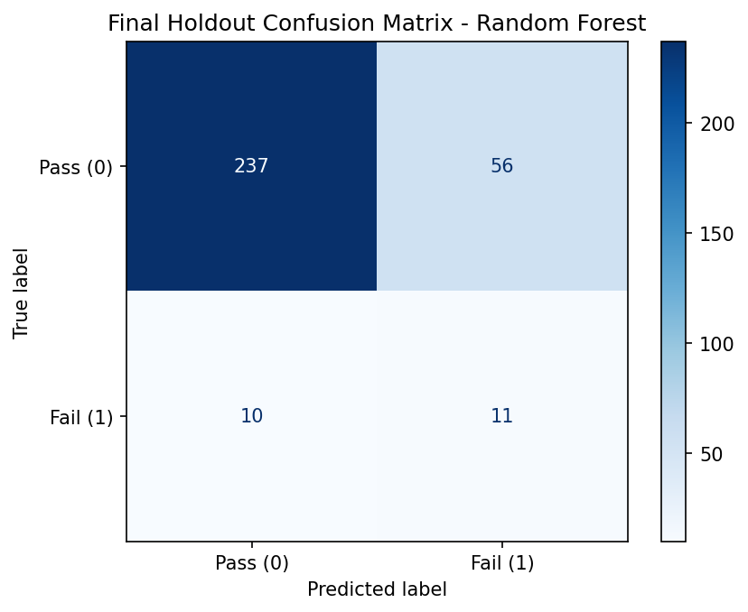
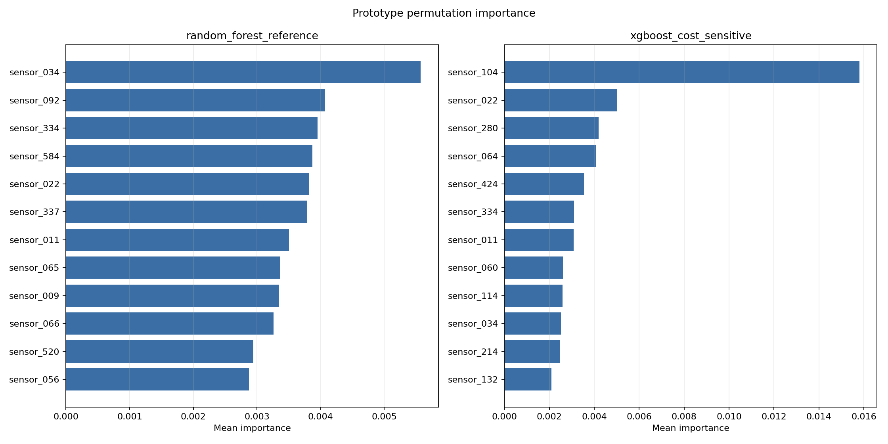
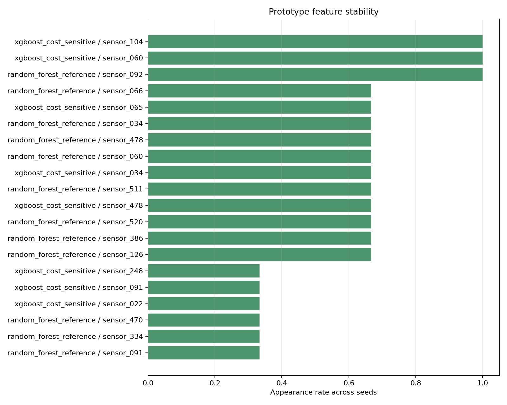

# Output Artifacts

This folder contains reviewed artifacts used by the Streamlit app, local API,
reports, and documentation. Training and analysis scripts create these files;
the app reads them without retraining models.

## Artifact Manifest

- [artifact_manifest.json](artifact_manifest.json) records the key metrics,
  figures, reports, and app-facing artifact descriptions.

## Baseline Metrics

| File | Description |
|---|---|
| [validation_metrics.csv](metrics/validation_metrics.csv) | Baseline validation metrics |
| [threshold_sweep.csv](metrics/threshold_sweep.csv) | Baseline validation threshold sweep |
| [rf_improvement_table.csv](metrics/rf_improvement_table.csv) | Random Forest comparison table |
| [final_test_metrics.csv](metrics/final_test_metrics.csv) | Baseline holdout metrics |
| [final_feature_importance.csv](metrics/final_feature_importance.csv) | Baseline Random Forest feature importance |

## Prototype Benchmark Metrics

| File | Description |
|---|---|
| [benchmark_model_comparison_prototype.csv](metrics/benchmark_model_comparison_prototype.csv) | Full six-model prototype benchmark |
| [benchmark_threshold_sweep_prototype.csv](metrics/benchmark_threshold_sweep_prototype.csv) | Prototype validation threshold sweep |

## Cost Threshold Metrics

| File | Description |
|---|---|
| [cost_threshold_sweep_prototype.csv](metrics/cost_threshold_sweep_prototype.csv) | Cost values for each model, threshold, and scenario |
| [cost_selected_thresholds_prototype.csv](metrics/cost_selected_thresholds_prototype.csv) | Selected thresholds under illustrative cost scenarios |

## Explainability Metrics

| File | Description |
|---|---|
| [permutation_importance_prototype.csv](metrics/permutation_importance_prototype.csv) | Prototype permutation importance |
| [feature_stability_prototype.csv](metrics/feature_stability_prototype.csv) | Feature stability across configured seeds |
| [top_sensor_signals_prototype.csv](metrics/top_sensor_signals_prototype.csv) | Cross-model top sensor signal summary |

## Baseline Figures

### Final confusion matrix

### Final precision-recall curve

### Final ROC curve

### Final feature importance

## Prototype Explainability Figures

### Permutation importance

### Feature stability

## Interpretation Notes

- The confusion matrix is the clearest visual for the baseline screening
  trade-off.
- The PR curve is important because the fail class is small.
- The ROC curve should not be read alone.
- Feature importance and permutation importance describe model-important sensor
  signals, not physical root causes.
- Cost artifacts use illustrative cost assumptions and do not create a
  production decision rule.

## Local MLflow Files

Local MLflow tracking files are not stored here. `mlflow.db`, `mlruns/`, and
`mlartifacts/` are ignored by Git.
